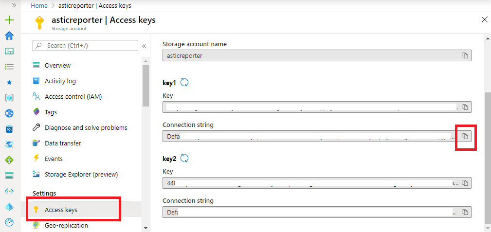
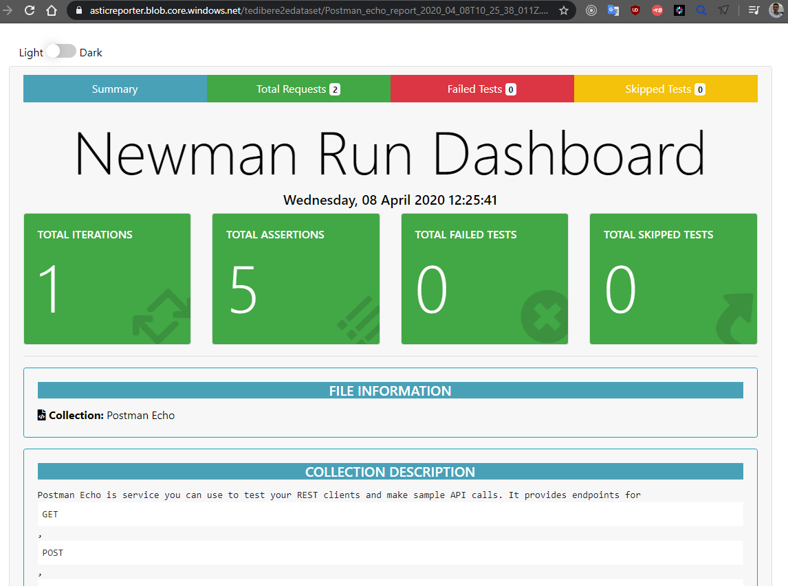
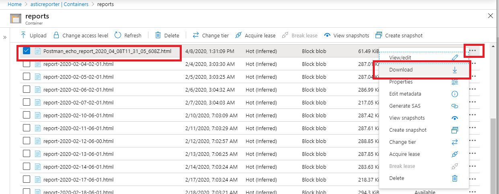

This a basic example of uploading newman report to Azure Blob storage.

I assume you already have : 
- Azure account and the sufficient privileges in your organization to read/update an Azure Blob. 
- Basic knowledge of Postman and newman to run your API tests

# Azure Credentials 
When the sample application makes a request to Azure Storage, it must be authorized. To authorize a request, add your storage account credentials to the application as a connection string. View your storage account credentials by following these steps:

1. Sign in to the **[Azure portal](https://portal.azure.com)**.
2. Locate your storage account.
3. In the **Settings** section of the storage account overview, select **Access keys**. Here, you can view your account access keys and the complete connection string for each key.
4. Find the Connection string value under key1, and select the Copy button to copy the connection string. You will add the connection string to the environment file in future steps.




# Change the container access level
The goal is that every one access the reports wether the report link is sent by mail, slack message or other messaging system. 

1. Locate your storage account in Azure Portal
2. In Blob service section of the storage account overview, select **Containers**
3. Select the container to host your reports
4. Click on **Change access level** button
5. Choose **Blob**
 


# Run and upload

Clone this repository and run `npm install`  
Create `.env` file and add your azure connection string in the following format : 
`CONNECTION_STRING=THE_CONNECTION_STRING_YOU_COPIED`  
Change the `CONTAINER_NAME` variable value with your actual container name

For this example I am using the Postman Echo collection, that already contains meaningful tests. I have created a public accessible link of the collection in my workspace. This link could be changed in the future, so I advice one of the following options to test this example :  
1.  **[Export a collection in JSON](https://learning.postman.com/docs/postman/collections/data-formats/#collections)** to get a collection file in your local fisk.
2. **[Generate a public link](https://learning.postman.com/docs/postman/collections/sharing-collections/#sharing-collections-with-a-link)** to get a publicly accessible link of your collection.
3.  **[Use the Postman API](https://learning.postman.com/docs/postman/postman-api/intro-api/)** to get the secured link of your collection.

Then update the collection value with the path/url of your collection : 

```js
newman.run({
    collection: 'https://www.getpostman.com/collections/deaa9461134ec64565e4',
    reporters: ['cli', 'htmlextra'],
    reporter: {
        htmlextra: {
            export: REPORT_NAME
        }
    }
}, async (err) => {
    if (err) throw err
    blobServiceClient  = BlobServiceClient.fromConnectionString(CONNECTION_STRING);
    containerClient    = await blobServiceClient.getContainerClient(CONTAINER_NAME);
    blockBlobClient    = await containerClient.getBlockBlobClient(REPORT_NAME)
    uploadBlobResponse = await blockBlobClient.uploadFile(REPORT_NAME, {
        progress: (ev) => console.log('Upload in progress', ev),
        blobHTTPHeaders: { blobContentType: 'text/html' }
    })
    console.log(`ReportURL : ${REPORT_URL} `)
    fs.unlink(REPORT_NAME, (err) => {
        if (err) {
            console.error(err)
          }
        console.log('Report removed from local disk')
    })
}) 
```
In your terminal run the following command : 
```
npm start
```
This will run the collection and generate an HTML report using the [html-extra](https://github.com/DannyDainton/newman-reporter-htmlextra) package. It is a custom newman reporter generating sexy API tests reports.

Once the execution finishes, an HTML report file will be created in the local disk. I preferred to delete the file after the upload  successfully finishes. You can comment the fs.unlink() instruction to override this behavior. 

The report is something that looks like :  



You can access it through the link in the console log directly or and download it from your Blob storage in the Azure Portal :  




This could also work for other type of automated test reports, like cypress or other JS based frameworks. 